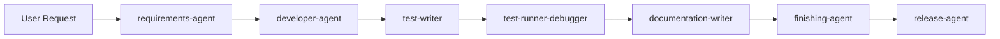
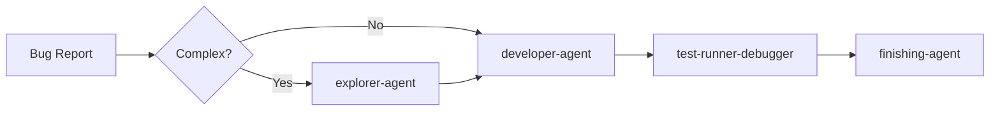
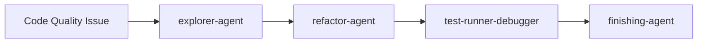
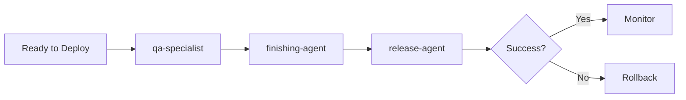

# AGENT_WORKFLOWS.md

**Agent Orchestration Guide for Outward Sign**

This document provides comprehensive workflows, decision trees, and integration patterns for the 10 specialized AI agents used in the Outward Sign project.

## Table of Contents

- [Overview](#overview)
- [Agent Inventory](#agent-inventory)
- [Decision Trees](#decision-trees)
- [Standard Workflows](#standard-workflows)
- [Agent Hand-off Patterns](#agent-hand-off-patterns)
- [Parallel vs Sequential Execution](#parallel-vs-sequential-execution)
- [Agent Conflict Resolution](#agent-conflict-resolution)
- [Common Scenarios](#common-scenarios)
- [Integration Patterns](#integration-patterns)
- [Quality Gates](#quality-gates)

---

## Overview

The Outward Sign project uses specialized agents to handle different aspects of software development. Each agent has specific expertise and responsibilities, and they work together in coordinated workflows to ensure high-quality code, comprehensive testing, thorough documentation, and safe deployments.

**Key Principles:**
- **Specialization**: Each agent focuses on one aspect of development
- **Orchestration**: Agents hand off to each other in defined sequences
- **Quality Gates**: Agents verify work before passing to next stage
- **Documentation-First**: All agents must read relevant docs before acting

---

## Agent Inventory

### Core Development Workflow (7 agents)

| Agent | Color | Purpose | Key Responsibilities |
|-------|-------|---------|---------------------|
| **requirements-agent** | 🟢 Green | Requirements gathering | Analyze requests, document specs, identify technical implications |
| **developer-agent** | 🟡 Yellow | Feature implementation | Code based on requirements, follow patterns, create migrations |
| **test-writer** | 🔴 Red | Test creation | Write comprehensive tests, update test registry |
| **test-runner-debugger** | 🟡 Yellow | Test execution | Run tests, debug failures, fix test issues |
| **documentation-writer** | 🔵 Blue | Documentation | Create/update docs, maintain consistency |
| **finishing-agent** | 🟣 Pink | Pre-commit QA | Final review, verify quality gates, prepare for commit |
| **release-agent** | 🔴 Red | Production deployment | Deploy to staging/production, rollback procedures |

### Code Quality & Discovery (3 agents)

| Agent | Color | Purpose | Key Responsibilities |
|-------|-------|---------|---------------------|
| **explorer-agent** | 🔵 Cyan | Codebase exploration | Map systems, trace data flows, find patterns |
| **refactor-agent** | 🟠 Orange | Code improvement | Eliminate duplication, optimize performance, improve types |
| **qa-specialist** | 🟣 Purple | Non-functional testing | Performance, accessibility, security audits |

---

## Decision Trees

### Primary Decision Tree: Which Agent Should I Use?

```
USER REQUEST
    │
    ├─ "Create new [feature/module]"
    │   └─ requirements-agent → developer-agent → test-writer → finishing-agent
    │
    ├─ "Fix bug in [feature]"
    │   ├─ Bug is clear/simple → developer-agent
    │   └─ Bug is complex/unclear → explorer-agent → developer-agent
    │
    ├─ "How does [feature] work?"
    │   └─ explorer-agent
    │
    ├─ "Tests are failing"
    │   └─ test-runner-debugger
    │
    ├─ "Write tests for [feature]"
    │   └─ test-writer → test-runner-debugger
    │
    ├─ "Code has duplication/is messy"
    │   └─ explorer-agent → refactor-agent → test-runner-debugger
    │
    ├─ "Update documentation"
    │   └─ documentation-writer
    │
    ├─ "Deploy to production"
    │   └─ qa-specialist → finishing-agent → release-agent
    │
    └─ "Performance/accessibility issues"
        └─ qa-specialist → developer-agent (fix) → finishing-agent
```

### Task Type Decision Tree

```
TASK CLASSIFICATION
    │
    ├─ UNDERSTANDING (exploration, investigation)
    │   └─ Use: explorer-agent
    │
    ├─ BUILDING (new features, bug fixes)
    │   └─ Use: requirements-agent → developer-agent
    │
    ├─ TESTING (writing or running tests)
    │   ├─ Writing → test-writer
    │   └─ Running/Debugging → test-runner-debugger
    │
    ├─ IMPROVING (refactoring, optimization)
    │   └─ Use: refactor-agent
    │
    ├─ DOCUMENTING (writing or updating docs)
    │   └─ Use: documentation-writer
    │
    ├─ QUALITY ASSURANCE (pre-commit review)
    │   └─ Use: finishing-agent
    │
    └─ DEPLOYING (production releases)
        └─ Use: qa-specialist → release-agent
```

---

## Standard Workflows

### Workflow 1: New Feature Development

**Full lifecycle from idea to production**



**Steps:**
1. **requirements-agent**: Analyze request, document requirements in `/requirements/`
2. **developer-agent**: Implement feature following requirements and project patterns
3. **test-writer**: Write comprehensive tests (happy path, errors, edge cases)
4. **test-runner-debugger**: Run tests, verify all pass
5. **documentation-writer**: Update relevant documentation (MODULE_REGISTRY.md, etc.)
6. **finishing-agent**: Final QA review (build, lint, tests, docs)
7. **release-agent**: Deploy to staging → production (when ready)

**Quality Gates:**
- Requirements document complete → proceed to development
- Implementation complete + builds → proceed to testing
- All tests pass → proceed to documentation
- Finishing-agent passes all checks → ready for commit
- QA-specialist approves → ready for release

---

### Workflow 2: Bug Fix

**From issue report to resolution**



**Steps:**
1. **explorer-agent** (if complex): Trace issue across codebase, identify root cause
2. **developer-agent**: Fix the bug
3. **test-runner-debugger**: Verify fix doesn't break existing tests
4. **finishing-agent**: Review fix before commit

**Optional:**
- **test-writer**: Add regression test if bug wasn't caught by existing tests
- **documentation-writer**: Update docs if bug revealed documentation gap

---

### Workflow 3: Refactoring

**Improve code quality without changing behavior**



**Steps:**
1. **explorer-agent**: Identify duplication, performance issues, or complexity
2. **refactor-agent**: Improve code structure, eliminate duplication, optimize
3. **test-runner-debugger**: Ensure refactoring didn't break anything
4. **finishing-agent**: Final review

**Quality Gates:**
- All tests must still pass after refactoring
- Build must succeed
- Behavior must be unchanged

---

### Workflow 4: Production Deployment

**Safe deployment to production**



**Steps:**
1. **qa-specialist**: Performance, accessibility, security audit
2. **finishing-agent**: Final code review, verify all quality gates
3. **release-agent**: Execute deployment (staging → production)
4. **Monitor**: Watch metrics, health checks
5. **Rollback** (if needed): release-agent executes rollback procedure

---

## Agent Hand-off Patterns

### Automatic Hand-offs

These hand-offs should happen **automatically** (AI proactively triggers next agent):

| From Agent | To Agent | Trigger Condition |
|------------|----------|-------------------|
| requirements-agent | developer-agent | Requirements document complete |
| developer-agent | finishing-agent | Implementation complete |
| test-writer | test-runner-debugger | Tests written |
| Any implementation | documentation-writer | Code changes complete |
| finishing-agent | release-agent | QA passed, ready for deploy |
| refactor-agent | test-runner-debugger | Refactoring complete |

**Example Automatic Hand-off:**
```
developer-agent: "I've completed the Baptisms module implementation."
[Automatically triggers]
finishing-agent: "I'll now review the implementation before commit."
```

### User-Directed Hand-offs

These hand-offs require **user decision** (AI asks user what to do next):

| From Agent | To Agent Options | User Decides |
|------------|------------------|--------------|
| explorer-agent | refactor-agent OR developer-agent | Refactor vs implement new feature |
| finishing-agent | developer-agent | Fix issues found during review |
| qa-specialist | developer-agent OR release-agent | Fix issues vs proceed anyway |
| release-agent | developer-agent | Rollback vs hotfix |

**Example User-Directed Hand-off:**
```
explorer-agent: "I found 5 instances of duplicate date validation logic."
AI: "Would you like me to use refactor-agent to extract this into a shared utility?"
User: "Yes, refactor it."
[User confirms, then triggers refactor-agent]
```

---

## Parallel vs Sequential Execution

### Can Run in Parallel

These agents can work simultaneously on the same codebase:

- **test-writer** + **documentation-writer** (both work on completed implementation)
- Multiple **test-runner-debugger** instances (different test files)
- **developer-agent** (on separate features in `/requirements/`)

**Example Parallel Execution:**
```bash
# Terminal 1
AI: Using test-writer to write wedding tests

# Terminal 2 (simultaneously)
AI: Using documentation-writer to update MODULE_REGISTRY.md
```

### Must Run Sequentially

These agents **cannot overlap** - they must complete in order:

| Sequence | Reason |
|----------|--------|
| requirements-agent → developer-agent | Requirements must be clear before coding |
| developer-agent → finishing-agent | Must implement before reviewing |
| test-writer → test-runner-debugger | Must write tests before running them |
| finishing-agent → release-agent | Must pass QA before deploying |
| refactor-agent → test-runner-debugger | Must finish refactoring before verifying |

**Anti-pattern (Don't Do This):**
```
❌ developer-agent implementing while finishing-agent reviews
   → finishing-agent will be reviewing incomplete code

✅ developer-agent completes → finishing-agent reviews
   → finishing-agent sees final, complete implementation
```

---

## Agent Conflict Resolution

### When Multiple Agents Could Handle a Task

| Task Description | Correct Agent | Why Not Others? |
|------------------|---------------|-----------------|
| "How does authentication work?" | **explorer-agent** | developer-agent would start coding, not explaining |
| "Improve code quality" | **refactor-agent** | developer-agent would add features, not refactor |
| "Tests are failing" | **test-runner-debugger** | developer-agent lacks test-specific debugging tools |
| "Update FORMS.md" | **documentation-writer** | developer-agent writes code docs, not comprehensive guides |
| "Fix duplication" | **refactor-agent** | developer-agent might not follow Rule of Three |
| "Deploy to production" | **release-agent** | developer-agent lacks deployment expertise |

### Rule of Thumb

**Always use the most specialized agent for the task.**

If unsure, ask:
1. Is this **understanding** existing code? → explorer-agent
2. Is this **building** new functionality? → developer-agent
3. Is this **testing** code? → test-writer or test-runner-debugger
4. Is this **improving** existing code? → refactor-agent
5. Is this **documenting** work? → documentation-writer
6. Is this **reviewing** before commit? → finishing-agent
7. Is this **deploying** to production? → release-agent
8. Is this **quality assurance** (performance/security/a11y)? → qa-specialist

---

## Common Scenarios

### Scenario 1: Creating a New Module

**User Request:** "Create a Confirmations module"

**Workflow:**
1. **requirements-agent**
   - Reads MODULE_CHECKLIST.md, MODULE_COMPONENT_PATTERNS.md
   - Creates `/requirements/2025-12-02-confirmations-module.md`
   - Documents database schema, server actions, UI components, tests needed

2. **developer-agent**
   - Reads requirements document
   - Reads MODULE_CHECKLIST.md, FORMS.md, DATABASE.md
   - Creates migration file for confirmations table
   - Implements 8 module files + print page
   - Creates server actions

3. **test-writer**
   - Reads TESTING_GUIDE.md
   - Writes `tests/confirmations.spec.ts`
   - Updates `docs/testing/TESTING_REGISTRY.md`

4. **test-runner-debugger**
   - Runs `npm test tests/confirmations.spec.ts`
   - Debugs any failures

5. **documentation-writer**
   - Updates MODULE_REGISTRY.md with confirmations entry
   - Creates module-specific documentation if needed

6. **finishing-agent**
   - Runs build, lint, all tests
   - Reviews migration, RLS policies
   - Creates review feedback in `/requirements/`
   - Confirms ready to commit

---

### Scenario 2: Debugging Test Failures

**User Report:** "Wedding tests are failing with 'element not found' errors"

**Workflow:**
1. **test-runner-debugger**
   - Runs `npm test tests/weddings.spec.ts` (headless first)
   - Analyzes error: selector hierarchy issue
   - Checks TESTING_ARCHITECTURE.md for selector best practices
   - Identifies missing `<Label>` with `htmlFor` in wedding form
   - Two options:
     - **Fix test selectors** (if app code is correct)
     - **Report app code issue** (if missing labels violate FORMS.md)

2. **developer-agent** (if app code needs fixing)
   - Adds proper `<Label>` components to wedding form
   - Follows FORMS.md patterns

3. **test-runner-debugger** (re-run)
   - Verifies tests now pass

4. **finishing-agent**
   - Reviews form changes
   - Confirms FORMS.md patterns followed

---

### Scenario 3: Performance Issue

**User Report:** "Weddings list page is slow with 100+ items"

**Workflow:**
1. **qa-specialist**
   - Runs Lighthouse on weddings list
   - Identifies issue: rendering all 100 cards without virtualization
   - Creates `/requirements/2025-12-02-weddings-list-performance.md`

2. **developer-agent**
   - Implements virtualization using existing patterns
   - Optimizes database queries (select only needed columns)

3. **test-runner-debugger**
   - Runs weddings tests to ensure behavior unchanged

4. **qa-specialist** (re-check)
   - Re-runs Lighthouse
   - Confirms performance improved

5. **finishing-agent**
   - Final review before commit

---

### Scenario 4: Code Duplication

**User Request:** "We're duplicating validation logic across 5 forms"

**Workflow:**
1. **explorer-agent**
   - Searches codebase for duplicate validation patterns
   - Finds 5 instances of same date validation
   - Reports findings with file paths and line numbers

2. **refactor-agent**
   - Reads CODE_CONVENTIONS.md (Rule of Three)
   - Extracts validation into `lib/helpers/validators.ts`
   - Updates all 5 forms to use shared validator
   - Ensures no behavior changes

3. **test-runner-debugger**
   - Runs all form tests
   - Verifies all still pass (behavior preserved)

4. **finishing-agent**
   - Reviews refactoring
   - Confirms duplication eliminated
   - Verifies tests pass

---

## Integration Patterns

### Pattern 1: Requirements → Implementation → Testing

```
requirements-agent
    ↓ (creates /requirements/feature.md)
developer-agent
    ↓ (reads requirements, implements)
test-writer
    ↓ (reads implementation, writes tests)
test-runner-debugger
    ↓ (runs tests, reports results)
documentation-writer
    ↓ (documents feature)
finishing-agent
    ↓ (final QA)
[Ready for commit]
```

### Pattern 2: Exploration → Improvement

```
explorer-agent
    ↓ (finds duplication/issues)
refactor-agent
    ↓ (improves code quality)
test-runner-debugger
    ↓ (ensures behavior preserved)
finishing-agent
    ↓ (reviews improvements)
[Ready for commit]
```

### Pattern 3: Quality Assurance → Deployment

```
qa-specialist
    ↓ (performance/security/a11y audit)
finishing-agent
    ↓ (final code review)
release-agent
    ↓ (deploy to staging)
[Smoke tests on staging]
release-agent
    ↓ (deploy to production)
[Monitor & verify]
```

---

## Quality Gates

Each agent enforces specific quality gates before passing work to the next agent.

### requirements-agent → developer-agent

**Quality Gates:**
- [ ] Requirements document created in `/requirements/`
- [ ] All 15+ technical areas analyzed (UI, server, database, etc.)
- [ ] User confirmed requirements are correct
- [ ] Dependencies identified
- [ ] Testing requirements documented

### developer-agent → finishing-agent

**Quality Gates:**
- [ ] Implementation complete
- [ ] All required files created (8 module files, migrations, etc.)
- [ ] Build passes (`npm run build`)
- [ ] Lint passes (`npm run lint`)
- [ ] Relevant documentation read before implementation

### test-writer → test-runner-debugger

**Quality Gates:**
- [ ] Test file created in `/tests/` directory
- [ ] Test covers happy path, errors, edge cases
- [ ] Test uses proper selectors (role > label > testId)
- [ ] Test registry updated

### test-runner-debugger → finishing-agent

**Quality Gates:**
- [ ] All tests pass
- [ ] No test failures or errors
- [ ] Test behavior verified

### finishing-agent → release-agent

**Quality Gates:**
- [ ] Build passes
- [ ] Lint passes
- [ ] All tests pass
- [ ] Documentation updated
- [ ] Database migrations safe
- [ ] No critical issues found

### qa-specialist → release-agent

**Quality Gates:**
- [ ] Lighthouse score acceptable
- [ ] Accessibility audit passed
- [ ] Security vulnerabilities addressed
- [ ] Performance meets budget
- [ ] No critical issues found

---

## Best Practices

### 1. Always Read Documentation First

Every agent must read relevant documentation before acting:
- requirements-agent reads MODULE_CHECKLIST.md before analyzing modules
- developer-agent reads FORMS.md before creating forms
- test-writer reads TESTING_GUIDE.md before writing tests

### 2. Use Hand-offs Explicitly

Don't assume the next agent will run automatically. Be explicit:
```
✅ "I've completed implementation. I'll now use finishing-agent to review."
❌ "Implementation complete." [No mention of next step]
```

### 3. Respect Agent Boundaries

Don't use agents outside their expertise:
```
✅ developer-agent implements → finishing-agent reviews
❌ developer-agent implements AND reviews itself
```

### 4. Document Hand-offs in Requirements

When creating requirements, note the expected workflow:
```markdown
## Implementation Workflow
1. developer-agent: Implement 8 module files
2. test-writer: Write comprehensive tests
3. documentation-writer: Update MODULE_REGISTRY.md
4. finishing-agent: Final review
```

### 5. Monitor Quality Gates

Each agent should verify quality gates before proceeding:
- Build must pass before tests
- Tests must pass before documentation
- All gates must pass before commit

---

## Troubleshooting

### Problem: Wrong agent was used

**Symptoms:** Code doesn't follow patterns, tests are brittle, documentation is incomplete

**Solution:**
1. Check Agent Quick Reference in CLAUDE.md
2. Verify correct agent for task type
3. Re-do work with correct agent

### Problem: Agent skipped quality gate

**Symptoms:** Build fails, tests fail, documentation outdated

**Solution:**
1. Use finishing-agent to identify all issues
2. Return to appropriate agent to fix
3. Re-run quality gates

### Problem: Hand-off unclear

**Symptoms:** Work stops, unclear what to do next

**Solution:**
1. Check Common Scenarios section
2. Identify current phase in workflow
3. Trigger next agent in sequence

---

## Summary

**Agent orchestration ensures:**
- ✅ Right agent for each task
- ✅ Consistent quality through gates
- ✅ Complete workflows from idea to production
- ✅ Documentation-first approach
- ✅ Safe deployments with rollback plans

**Key Takeaway:** When in doubt, consult the Decision Trees section and choose the most specialized agent for your task.
