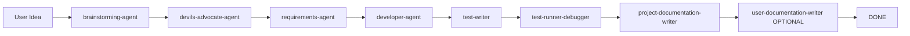

# AGENT_WORKFLOWS.md

**Agent Orchestration Guide for Outward Sign**

This document provides comprehensive workflows, decision trees, and integration patterns for the specialized AI agents used in the Outward Sign project.

## Table of Contents

- [Overview](#overview)
- [Agent Inventory](#agent-inventory)
- [Folder Ownership](#folder-ownership)
- [Decision Trees](#decision-trees)
- [Standard Workflow](#standard-workflow)
- [Optional Gates](#optional-gates)
- [Agent Hand-off Patterns](#agent-hand-off-patterns)
- [Common Scenarios](#common-scenarios)
- [Quality Gates](#quality-gates)
- [Best Practices](#best-practices)

---

## Overview

The Outward Sign project uses specialized agents to handle different aspects of software development. The workflow is designed around **two key phases**:

1. **Divergent Phase** (Creative) - Brainstorming and exploration
2. **Convergent Phase** (Technical) - Requirements analysis and implementation

**Key Principles:**
- **Specialization**: Each agent focuses on one aspect of development
- **Folder Ownership**: Each agent owns a specific folder
- **Documentation-First**: Capture vision before technical analysis
- **Optional Gates**: User can review at key decision points
- **Smart Loop-Back**: Issues are routed to the appropriate agent for fixes

---

## Agent Inventory

### Complete Agent List (18 agents)

| Agent | Folder | Role | Phase |
|-------|--------|------|-------|
| **brainstorming-agent** | `/brainstorming/` | Capture creative vision | Divergent |
| **devils-advocate-agent** | `/brainstorming/` | Challenge and refine vision | Divergent |
| **requirements-agent** | `/requirements/` | Technical analysis | Convergent |
| **developer-agent** | `/src/` | Implementation | Execution |
| **test-writer** | `/tests/` | Test creation | Execution |
| **test-runner-debugger** | N/A (read-only) | Test execution | Execution |
| **project-documentation-writer** | `/docs/` | Developer docs | Execution |
| **supervisor-agent** | `/supervisor/` | Codebase health audits | Execution |
| **cleanup-agent** | N/A | Mechanical code fixes | Execution |
| **user-documentation-writer** | `/src/app/documentation/content/` | End-user guides | Optional |
| **release-agent** | `/releases/` | Deployment | Optional |
| **explorer-agent** | N/A | Codebase exploration | As-needed |
| **refactor-agent** | N/A | Code improvement | As-needed |
| **qa-specialist** | N/A | Performance/security | As-needed |
| **ui-agent** | N/A (read-only) | Visual styling audits | As-needed |
| **ux-agent** | N/A (read-only) | User understanding audits | As-needed |
| **wisdom-agent** | N/A (read-only) | Perspective and encouragement | As-needed |
| **agent-audit-agent** | `/agent-audit-agent/` | Agent ecosystem audits | As-needed |
| **branch-merge-agent** | N/A | Evaluate and merge Claude branches | As-needed |

---

## Folder Ownership

Each agent "owns" a specific folder where it creates and manages files:

| Folder | Owner | Purpose | Lifecycle |
|--------|-------|---------|-----------|
| `/brainstorming/` | brainstorming-agent, devils-advocate-agent | Initial feature visions | Temporary (files move to /requirements/) |
| `/requirements/` | requirements-agent | Technical specifications | Permanent |
| `/src/` | developer-agent | Source code | Permanent |
| `/tests/` | test-writer | Test files | Permanent |
| `/docs/` | project-documentation-writer | Developer/agent docs | Permanent |
| `/releases/` | release-agent | Deployment logs | Permanent (audit trail) |
| `/src/app/documentation/content/` | user-documentation-writer | End-user guides | Permanent |
| `/supervisor/` | supervisor-agent | Codebase health reports | Permanent (audit trail) |
| `/agent-audit-agent/` | agent-audit-agent | Agent ecosystem audit reports | Permanent (audit trail) |

**Read-only agents** (no folder ownership):
- test-runner-debugger (runs tests)
- cleanup-agent (fixes mechanical issues in /src/)
- explorer-agent (explores codebase)
- refactor-agent (improves code in /src/)
- qa-specialist (audits quality)
- ui-agent (audits visual styling)
- ux-agent (audits user understanding)
- wisdom-agent (provides perspective and encouragement)
- branch-merge-agent (manages git branches - has extended git permissions)

---

## Decision Trees

### Primary Decision Tree: Which Agent Should I Use?

```
USER REQUEST
    │
    ├─ "I have an idea for a new feature"
    │   └─ brainstorming-agent → devils-advocate-agent → requirements-agent → developer-agent
    │
    ├─ "Create new [feature/module]"
    │   └─ brainstorming-agent → devils-advocate-agent → requirements-agent → developer-agent → test-writer → test-runner-debugger → project-documentation-writer
    │
    ├─ "Challenge/review brainstorming" or "Poke holes in this"
    │   └─ devils-advocate-agent → requirements-agent
    │
    ├─ "Fix bug in [feature]"
    │   ├─ Bug is clear/simple → developer-agent → test-writer (regression test) → test-runner-debugger
    │   └─ Bug is complex/unclear → explorer-agent → developer-agent → test-writer (regression test) → test-runner-debugger
    │
    ├─ "How does [feature] work?"
    │   └─ explorer-agent
    │
    ├─ "Tests are failing"
    │   └─ test-runner-debugger
    │
    ├─ "Write tests for [feature]"
    │   └─ test-writer → test-runner-debugger
    │
    ├─ "Code has duplication/is messy"
    │   └─ explorer-agent → refactor-agent → test-runner-debugger
    │
    ├─ "Update /docs/ documentation"
    │   └─ project-documentation-writer
    │
    ├─ "Create end-user guide"
    │   └─ user-documentation-writer
    │
    ├─ "Deploy to production"
    │   └─ qa-specialist → release-agent
    │
    ├─ "Performance/accessibility issues"
    │   └─ qa-specialist → developer-agent (fix) → test-runner-debugger
    │
    ├─ "UI looks inconsistent/styling issues"
    │   └─ ui-agent → developer-agent (fix) → test-runner-debugger
    │
    ├─ "Labels/navigation/descriptions unclear"
    │   └─ ux-agent → developer-agent (fix) → test-runner-debugger
    │
    ├─ "I'm stuck/overwhelmed/need perspective"
    │   └─ wisdom-agent (conversational support, no code changes)
    │
    ├─ "Run a health check/audit the codebase"
    │   └─ supervisor-agent → produces report → cleanup-agent (for lint) or developer-agent (for judgment fixes)
    │
    ├─ "Fix linting errors" or "run lint fix"
    │   └─ cleanup-agent (runs lint --fix in isolation, verifies build)
    │
    ├─ "Audit agents/settings/hooks"
    │   └─ agent-audit-agent → produces report → DONE (user decides next steps)
    │
    └─ "Merge Claude branches" or "Clean up Claude branches"
        └─ branch-merge-agent → fetch → evaluate → merge → cleanup
```

---

## Standard Workflow

### The Complete 8-Step Workflow



**Periodic maintenance (separate from feature workflow):**
- supervisor-agent → identifies issues
- cleanup-agent → fixes lint (in isolation)
- developer-agent → fixes issues requiring judgment

### Step-by-Step Breakdown

**1. brainstorming-agent (DIVERGENT - Creative)**
- **Input:** User's initial idea or problem
- **Folder:** `/brainstorming/`
- **Output:** Vision document with user stories, scope, success criteria
- **Action:** Creates `/brainstorming/YYYY-MM-DD-feature.md`
- **Next:** devils-advocate-agent (challenges vision, finds gaps)

**2. devils-advocate-agent (DIVERGENT - Critical Review)**
- **Input:** Vision document from `/brainstorming/`
- **Folder:** `/brainstorming/`
- **Output:** Same document with "## Review Notes" section appended
- **Action:** Asks 1-3 probing questions at a time about completeness, feasibility, edge cases
- **Interaction:** Continues until user says "proceed", then moves file to `/requirements/`
- **Next:** requirements-agent (reads reviewed vision, adds technical specs)

**3. requirements-agent (CONVERGENT - Analytical)**
- **Input:** Vision document from `/requirements/`
- **Folder:** `/requirements/`
- **Output:** Expanded document with database schema, server actions, UI components
- **Action:** Adds technical requirements to existing vision document
- **Next:** developer-agent (implements based on requirements)

**4. developer-agent (EXECUTION - Building)**
- **Input:** Requirements document from `/requirements/`
- **Folder:** `/src/`
- **Output:** Implemented features (migrations, server actions, UI components)
- **Special:** If multiple modules, can pause after first module for review
- **Next:** test-writer (creates tests for implementation)

**5. test-writer (EXECUTION - Quality Assurance)**
- **Input:** Implemented code in `/src/`
- **Folder:** `/tests/`
- **Output:** Test files covering happy path, errors, edge cases
- **Action:** Creates `tests/[module].spec.ts`, updates TESTING_REGISTRY.md
- **Next:** test-runner-debugger (runs tests)

**6. test-runner-debugger (EXECUTION - Verification)**
- **Input:** Test files in `/tests/`
- **Folder:** N/A (read-only)
- **Output:** Test results (pass/fail)
- **Action:** Runs `npm test`, debugs failures
- **Next:** project-documentation-writer (updates docs)

**7. project-documentation-writer (EXECUTION - Documentation)**
- **Input:** Completed, tested implementation
- **Folder:** `/docs/`
- **Output:** Updated MODULE_REGISTRY.md, COMPONENT_REGISTRY.md, guides
- **Action:** Documents new patterns, updates registries
- **Next:** DONE (or user-documentation-writer if requested)

**8. user-documentation-writer (OPTIONAL - End-User Guides)**
- **Input:** User request for end-user documentation
- **Folder:** `/src/app/documentation/content/`
- **Output:** Bilingual (en/es) user guides for parish staff
- **Action:** Creates step-by-step guides for non-technical users
- **Next:** DONE

---

## Maintenance Workflow

**For periodic codebase health:**

**1. supervisor-agent (AUDIT)**
- **Input:** Request for health check
- **Folder:** `/supervisor/`
- **Output:** Health report with categorized issues
- **Action:** Identifies linting, security, pattern, and other issues
- **Next:** User decides which issues to address

**2. cleanup-agent (LINT FIXES ONLY)**
- **Input:** Linting issues from supervisor report (or direct request)
- **Folder:** N/A (modifies /src/)
- **Output:** Lint fixes applied, build verified
- **Action:** Runs `npm run lint -- --fix` in isolation, reports changes
- **Critical:** Requires clean working directory, verifies build after
- **Next:** DONE (or developer-agent if build fails)

**3. developer-agent (JUDGMENT FIXES)**
- **Input:** Non-mechanical issues from supervisor report
- **Folder:** `/src/`
- **Output:** Code fixes for issues requiring judgment
- **Action:** Fixes security, pattern, and logic issues
- **Next:** test-runner-debugger to verify

---

## Optional Gates

Gates allow the user to review and approve before proceeding. All gates are **optional** and can be set to auto-continue.

### Gate 1: After Brainstorming (Devil's Advocate Review)
**Location:** Between brainstorming-agent and requirements-agent

**Question:** "Would you like me to challenge this brainstorming before we proceed to requirements?"

**Options:**
- A) Yes, use devils-advocate-agent to find gaps (recommended for new features)
- B) Skip review and proceed directly to requirements-agent

**When to use:** Recommended for all new features. The devils-advocate-agent helps identify holes, ambiguities, and edge cases before technical analysis begins.

**Note:** When devils-advocate-agent runs, it will continue asking questions (1-3 at a time) until you say "proceed"

### Gate 2: After Requirements
**Location:** Between requirements-agent and developer-agent

**Question:** "Would you like to review the technical requirements before development starts?"

**Options:**
- A) Auto-continue (default)
- B) Review and approve first

**When to use:** When technical approach needs validation or has multiple options

### Gate 3: Multi-Module Implementation
**Location:** During developer-agent execution (after first module complete)

**Question:** "I see this requires implementing [X] modules. Would you like me to: A) Implement all modules without pausing, or B) Pause after the first module for review?"

**Options:**
- A) Implement all modules in sequence
- B) Pause after first module for review

**When to use:** When implementing multiple modules and want to verify first module before continuing

---

## Agent Hand-off Patterns

### Automatic Hand-offs

These hand-offs happen **automatically** (AI proactively triggers next agent):

| From Agent | To Agent | Trigger Condition |
|------------|----------|-------------------|
| brainstorming-agent | devils-advocate-agent | Vision document created in /brainstorming/ |
| devils-advocate-agent | requirements-agent | User says "proceed"; file moved to /requirements/ |
| requirements-agent | developer-agent | Requirements complete |
| developer-agent | test-writer | Implementation complete |
| test-writer | test-runner-debugger | Tests written |
| test-runner-debugger | project-documentation-writer | All tests pass |
| project-documentation-writer | DONE | Docs updated (user-documentation-writer if requested) |

### Maintenance Hand-offs

| From Agent | To Agent | Trigger Condition |
|------------|----------|-------------------|
| supervisor-agent | cleanup-agent | Linting issues identified |
| supervisor-agent | developer-agent | Issues requiring judgment identified |
| cleanup-agent | developer-agent | Build fails after lint fix (needs judgment) |

---

## Common Scenarios

### Scenario 1: Creating a New Module

**User Request:** "Create a Confirmations module"

**Workflow:**
1. **brainstorming-agent**
   - Creates `/brainstorming/2025-12-02-confirmations-module.md`
   - Captures user stories, scope, success criteria

2. **devils-advocate-agent**
   - Reads vision document
   - Asks probing questions about edge cases, permissions, integration
   - User answers questions until satisfied
   - User says "proceed"
   - Appends "## Review Notes" section with Q&A and unresolved concerns
   - Moves file to `/requirements/2025-12-02-confirmations-module.md`

3. **requirements-agent**
   - Reads reviewed vision document (including Review Notes)
   - Searches codebase for patterns
   - Adds database schema, server actions, UI components, testing needs

4. **developer-agent**
   - Creates migration for confirmations table
   - Implements 8 module files
   - Creates server actions

5. **test-writer**
   - Writes `tests/confirmations.spec.ts`
   - Updates TESTING_REGISTRY.md

6. **test-runner-debugger**
   - Runs tests, verifies all pass

7. **project-documentation-writer**
   - Updates MODULE_REGISTRY.md
   - Updates TESTING_REGISTRY.md
   - Creates module-specific docs if needed
   - DONE (ready to commit)

### Scenario 1b: Challenging Existing Brainstorming

**User Request:** "Poke holes in this" (after brainstorming complete)

**Workflow:**
1. **devils-advocate-agent**
   - Reads existing vision document from `/brainstorming/`
   - Cross-references with codebase patterns
   - Asks probing questions: "What happens when the sponsor backs out?"
   - User: "We'll mark them as unavailable and require a replacement"
   - Asks more questions until user says "proceed"
   - Appends Review Notes with all Q&A
   - Moves file to `/requirements/`

2. **requirements-agent** continues as normal

### Scenario 2: Debugging Test Failures

**User Report:** "Wedding tests are failing"

**Workflow:**
1. **test-runner-debugger**
   - Runs `npm test tests/weddings.spec.ts`
   - Analyzes error: missing <Label> in form
   - Identifies: App code issue (not test issue)

2. **developer-agent** (loop back)
   - Adds proper <Label> components
   - Follows FORMS.md patterns

3. **test-runner-debugger** (re-run)
   - Tests now pass
   - DONE (ready to commit)

### Scenario 3: Performance Optimization

**User Report:** "Weddings list page is slow"

**Workflow:**
1. **qa-specialist**
   - Runs Lighthouse
   - Identifies: Rendering all 100 cards without virtualization
   - Creates `/requirements/2025-12-02-weddings-performance.md`

2. **developer-agent**
   - Implements virtualization
   - Optimizes queries

3. **test-runner-debugger**
   - Runs wedding tests
   - Verifies behavior unchanged

4. **qa-specialist** (re-check)
   - Confirms performance improved
   - DONE (ready to commit)

### Scenario 4: Deployment to Production

**User Request:** "Deploy Confirmations module to production"

**Workflow:**
1. **qa-specialist**
   - Performance audit
   - Security audit
   - Accessibility check

2. **release-agent**
   - Creates `/releases/2025-12-02-confirmations-module.md`
   - Validates environment
   - Deploys to staging
   - Smoke tests pass
   - Deploys to production
   - Updates release document with results

---

## Quality Gates

Each agent enforces specific quality gates before passing work to the next agent.

### brainstorming-agent → devils-advocate-agent
- [ ] Vision document created in `/brainstorming/`
- [ ] Feature overview clear
- [ ] User stories documented
- [ ] Success criteria defined
- [ ] Scope defined (in/out)
- [ ] User confirmed vision is complete

### devils-advocate-agent → requirements-agent
- [ ] Vision document reviewed for gaps
- [ ] Probing questions asked about completeness, feasibility, edge cases
- [ ] User answered questions satisfactorily
- [ ] User said "proceed" or equivalent
- [ ] Review Notes section appended to document
- [ ] Unresolved concerns flagged for requirements-agent
- [ ] Document moved to `/requirements/`

### requirements-agent → developer-agent
- [ ] Vision document expanded with technical specs
- [ ] Database schema specified
- [ ] Server actions listed
- [ ] UI components identified
- [ ] Testing requirements documented
- [ ] Codebase searched for patterns
- [ ] Status updated to "Ready for Development"

### developer-agent → test-writer
- [ ] Implementation complete
- [ ] Build passes (`npm run build`)
- [ ] Lint passes (`npm run lint`)
- [ ] All required files created
- [ ] Follows project patterns
- [ ] Migration files created (if database changes)

### test-writer → test-runner-debugger
- [ ] Test file created in `/tests/`
- [ ] Tests cover happy path, errors, edge cases
- [ ] Test uses proper selectors (role > label > testId)
- [ ] TESTING_REGISTRY.md updated

### test-runner-debugger → project-documentation-writer
- [ ] All tests pass
- [ ] No test failures or errors
- [ ] Implementation stable

### project-documentation-writer → DONE
- [ ] MODULE_REGISTRY.md updated (if applicable)
- [ ] COMPONENT_REGISTRY.md updated (if applicable)
- [ ] Guide docs updated with new patterns
- [ ] Cross-references added
- [ ] File size limits respected (<1000 lines)

### cleanup-agent → DONE (or developer-agent if build fails)
- [ ] Working directory was clean before running
- [ ] `npm run lint -- --fix` executed
- [ ] Files changed are documented
- [ ] `npm run build` passes
- [ ] Revert commands provided if needed

---

## Best Practices

### 1. Always Use the Right Agent for the Task
- **Brainstorming?** → brainstorming-agent (not requirements-agent)
- **Challenge brainstorming?** → devils-advocate-agent (after brainstorming)
- **Technical analysis?** → requirements-agent (not developer-agent)
- **Update /docs/?** → project-documentation-writer (not user-documentation-writer)
- **End-user guides?** → user-documentation-writer (not project-documentation-writer)

### 2. Respect Folder Ownership
- brainstorming-agent creates in `/brainstorming/`
- devils-advocate-agent reviews in `/brainstorming/`, moves to `/requirements/`
- requirements-agent expands files in `/requirements/`
- developer-agent creates in `/src/`
- test-writer creates in `/tests/`
- project-documentation-writer updates `/docs/`
- release-agent creates in `/releases/`

### 3. Use Gates Wisely
- **Don't skip gates for complex features** - Take time to review vision and requirements
- **Auto-continue for simple changes** - Speed up workflow when confident
- **Use multi-module gate** - Catch issues early before implementing all modules

### 4. Trust the Smart Loop-Back
- code-review-agent will identify the right agent to fix issues
- Don't manually route - let code-review-agent decide
- Follow the recommended order for multiple issues

### 5. Document Everything
- brainstorming-agent captures vision
- devils-advocate-agent captures Q&A and unresolved concerns
- requirements-agent captures technical specs
- code-review-agent creates review feedback
- release-agent creates deployment logs
- This creates a complete audit trail

---

## Summary

**The Outward Sign workflow ensures:**
- ✅ Creative vision captured before technical analysis
- ✅ Vision challenged for gaps and edge cases before requirements
- ✅ Clear folder ownership and organization
- ✅ Systematic quality gates at each step
- ✅ Complete documentation from idea to deployment
- ✅ Safe, isolated lint fixes via cleanup-agent
- ✅ Audit trail of all decisions and changes

**Key Takeaways:**
- New features: brainstorming → devils-advocate → requirements → developer → test-writer → test-runner → docs
- Lint fixes: cleanup-agent (always in isolation, always verify build)
- Health checks: supervisor-agent → cleanup-agent (lint) or developer-agent (judgment)
- Branch cleanup: branch-merge-agent (fetch → evaluate → merge → cleanup)
